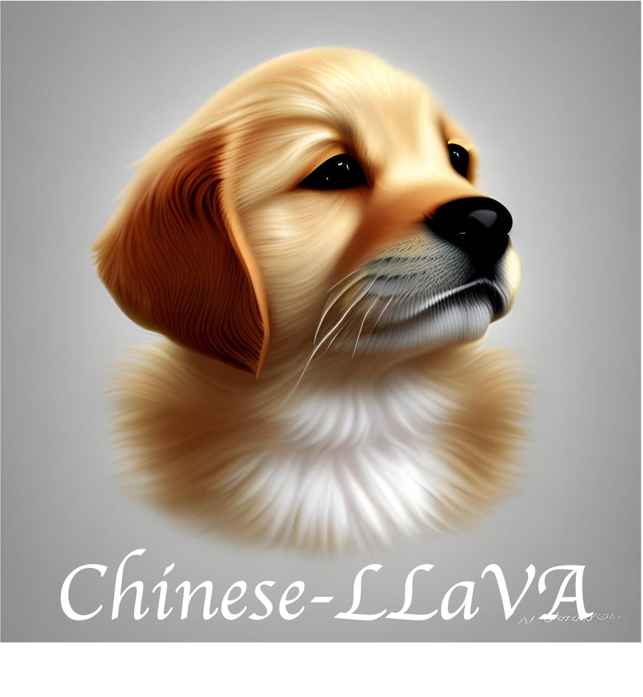
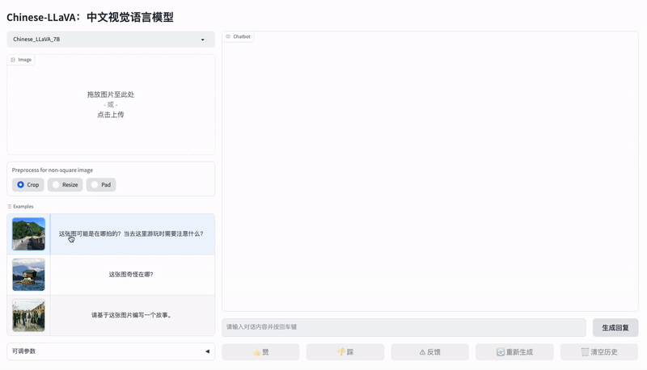

# Chinese LLaVA

[](https://huggingface.co/spaces/LinkSoul/Chinese-LLaVA) [](https://huggingface.co/spaces/LinkSoul/Chinese-LLaVA) [](https://github.com/LinkSoul-AI/Chinese-LLaVA/blob/main/LICENSE) [](https://huggingface.co/spaces/LinkSoul/Chinese-LLaVA) [](https://huggingface.co/spaces/LinkSoul/Chinese-LLaVA)

开源，可商用的**中英文双语视觉-语言助手 Chinese-LLaVA 以及中英文视觉 SFT 数据集 Chinese-LLaVA-Vision-Instructions**，支持中英文视觉-文本多模态对话的开源可商用对话模型。

<p align="center">
    
</p>

## 基础演示



## 在线试玩

> Talk is cheap, Show you the Demo.
- [Demo 地址 / HuggingFace Spaces](https://huggingface.co/spaces/LinkSoul/Chinese-LLaVA) 

## 资源下载

- HuggingFace模型下载：
  - [Chinese-LLaVA-Chinese-Llama-2-7B](https://huggingface.co/LinkSoul/Chinese-LLaVA-Cllama2)
  - [Chinese-LLaVA-Baichuan-7B](https://huggingface.co/LinkSoul/Chinese-LLaVA-Baichuan)

- 百度网盘下载:
  - [Chinese-LLaVA-Chinese-Llama-2-7B](https://pan.baidu.com/s/16e_LEacMy2bqOYanIFWy8Q?pwd=9j61)
  - [Chinese-LLaVA-Baichuan-7B](https://pan.baidu.com/s/1WuYPrIaul0i6KA-to98cHw?pwd=6jwz)

- 语言模型:
  - [Chinese-Llama-2-7b](https://github.com/LinkSoul-AI/Chinese-Llama-2-7b)
  - [Baichuan-7B](https://huggingface.co/baichuan-inc/Baichuan-7B)

- 数据集：[Chinese-LLaVA-Vision-Instructions](https://huggingface.co/datasets/LinkSoul/Chinese-LLaVA-Vision-Instructions)

## 环境安装
```shell
# clone the repository
git clone https://github.com/LinkSoul-AI/Chinese-LLaVA
cd Chinese-LLaVA

# install package
conda create -n Cllava python=3.10 -y
conda activate Cllava
pip install --upgrade pip
pip install -e .
```

## 快速测试

```shell
python infer.py \
    --model-name PATH/TO/THE/CHINESE_LLAVA_MODEL \
    --llm-type "Chinese_llama2" or "baichuan" \
    --image-file PATH/TO/THE/INPUT/IMAGE \
    --query QUERY/PROMPT
```

## TODO
- 如何训练
- int4 量化
- docker 部署

## 相关项目

- [LLaVA](https://llava-vl.github.io/)
- [Chinese-Llama-2-7B](https://huggingface.co/LinkSoul/Chinese-Llama-2-7b)
- [baichuan-inc/Baichuan-7B](https://huggingface.co/baichuan-inc/Baichuan-7B)


## 项目协议

[Apache-2.0 license](https://github.com/LinkSoul-AI/Chinese-LLaVA/blob/main/LICENSE)

## 微信交流群


